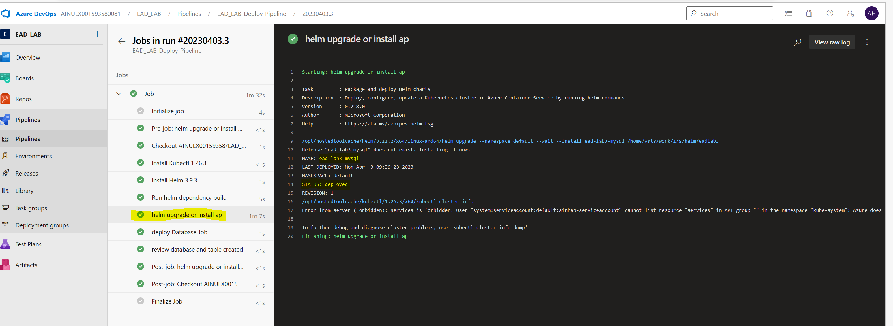
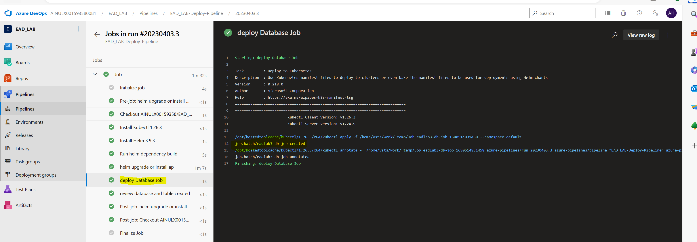
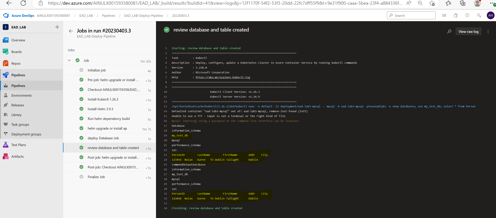

# EAD_LAB_3
## Created a Helm Pipeline for Lab 3 (Helm)
Steps are

###  Deploy Helm on Azure agent Nodes

Deploy MYSQL and DB Creation Script file Chart */helm/eadlab3/Charts.yaml*
 
This Creates:

 - MySql Server Deployment
 - A Secret by name of *ead-lab3-mysql*
 - A configMap to store the db-script file by name of  *db-scripts-configmap*
  
 
  
  ### Created a Job to connect to MySql Database
Created a Job  which uses mysql secrets *ead-lab3-mysql* ,  and database script file *db-scripts-configmap* to connect to MySql DB and create a Database
  
 

### Finally
Finally run a shell script to call kubectl and execute to validate and read data from database
  
  
 
